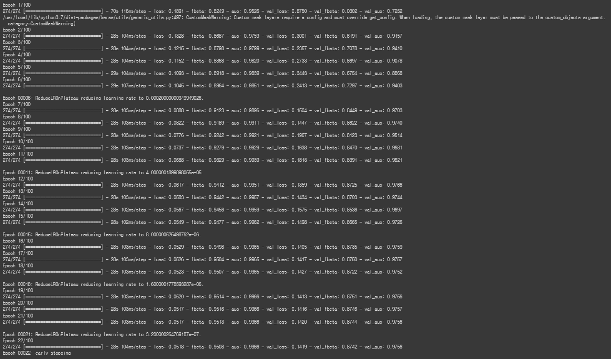
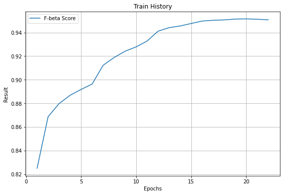

# Amazon rainforest analysis with Efficientnet

This notebook is based on kaggle competition "Planet: Understanding the Amazon from Space"  
(link : https://www.kaggle.com/c/planet-understanding-the-amazon-from-space/overview)

This competition is from 5 years ago, so there were no EfficientNet implementations that I could find. This notebook attempts to apply EfficientNet-B0 backbone to analyze given data.

Code from Anokas was a very helpful reference. See the link below.  
(link : https://www.kaggle.com/anokas/simple-keras-starter)

To run this code, you need following dependencies installed:
- tensorflow
- tensorflow_addons
- keras
- numpy
- pandas
- cv2
- tqdm
- matplotlib

Also, download dataset from the link above and unzip the files.  
train_v2.csv and image files from train-jpg folder will be used, so provide each of these files to methods pd.read_csv() and cv2.imread() respectively.

Train results are as follows:  
Early stoppage occurs at epoch 22 with f-beta score of 0.9508

F-beta Score graph:  

According to the leaderboard, best f-beta scores are below 0.93 and we have 0.95.  
So EfficientNet proves to be very good at analyzing images in this project.
